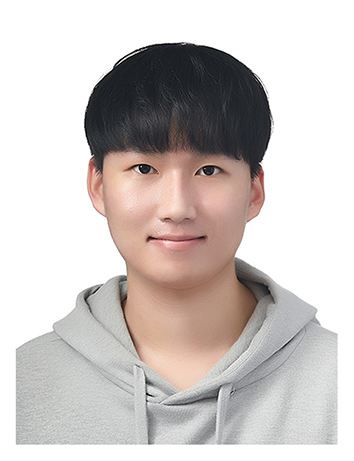
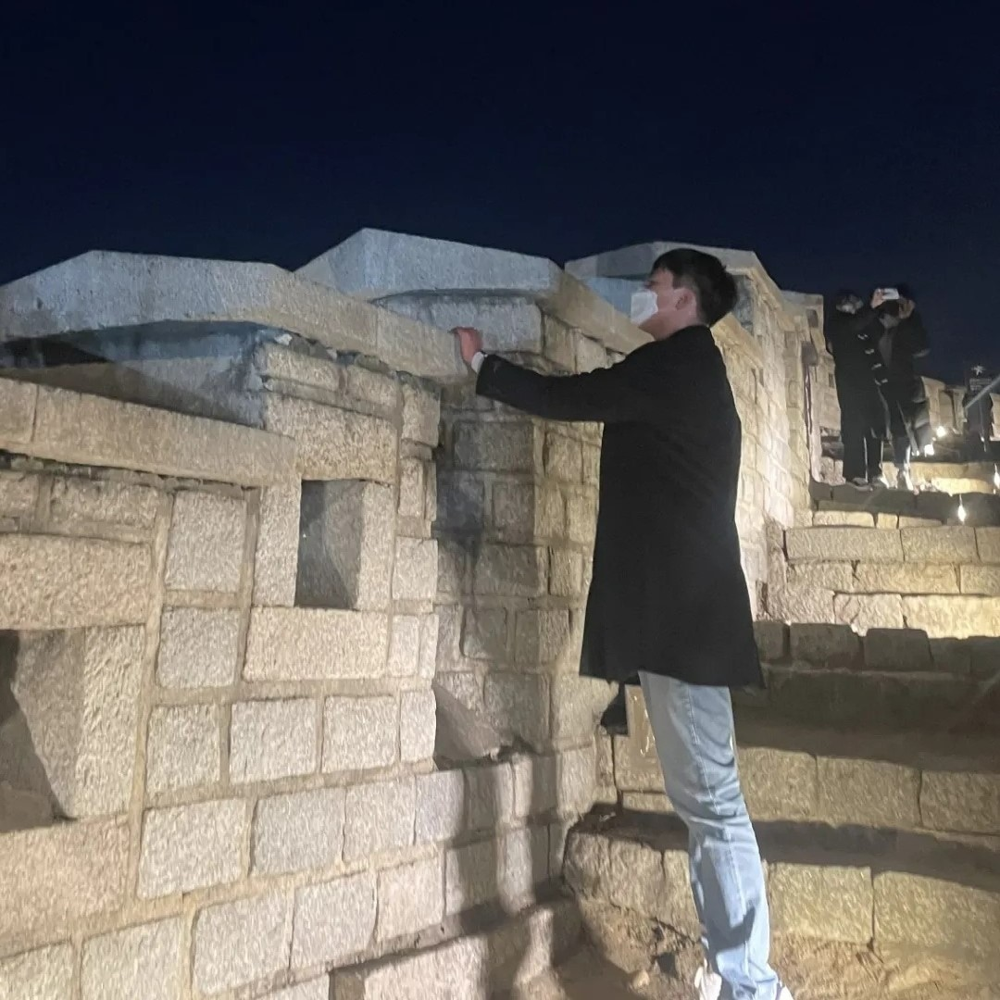

<html>
    <head>
        
    </head>
    <body>
        

            <h1 class = "small_" style="margin-top: 1em; margin-bottom: 0.3em">Juyeong Shin, Bachelor Candidate</h1>
            <h1 class = "large_" style="margin-top: 1em; margin-bottom: 0.3em">Juyeong Shin, Bachelor Candidate</h1>
        

        

            

                
            

            

                <h2 style="margin-top: 0.5em">Motto and Passion</h2>
                
Learning, Thinking, Solution, Practice

                
Thinking about the explanation with grounds

                
Knowledge Processing, Representation, Sharing

                
Existentialism, Humanism, Kategorischer Imperativ, 仁

                
Friedrich Nietzsche, Bertrand Russell, Immanuel Kant, 孔子

                
Knowing the difference and not evaluating

                <h2 style="margin-top: 1.5em">Introduction</h2>
                
Computer Science &amp; Engineering, Kyung Hee Univ.

                
Software Engineer, Data &amp; Knowledge Engineering Lab.

                
Email: <a href="mailto:bl4angel20@khu.ac.kr">bl4angel20@khu.ac.kr</a> / <a href="mailto:bl4angel20@gmail.com">bl4angel20@gmail.com</a>

                
SNS: <a href="https://instagram.com/meong_ju0o0">Instagram</a> / <a href="https://facebook.com/meongju0o0">Facebook</a> / <a href="https://github.com/meongju0o0">GitHub</a> / <a href="https://scholar.google.com/citations?user=ND0oIHUAAAAJ&hl=ko">Google Scholar</a>

                
Location: Yeongtong-gu, Suwon-si, Republic of Korea

            

        

    </body>
</html>

## Education
* Department of Computer Science and Engineering, Kyung Hee University, Republic of Korea, Bachelor Candidate, 2019.03 -- 2026.02
    - GPA: 3.6 / 4.3
* Gumi High School Science Department, Republic of Korea, High School Diploma, 2016.03 -- 2019.02

## Work Experience
* 2022.04 -- 2026.02: Data & Knowledge Engineering Labortory, Kyung Hee University, **Research Intern**
* 2022.09 -- 2022.12: T.G.WinG Machine Learning Study, **Lecturer**
* 2022.06 -- 2022.07: Samsung SDS Machine Learning Lecture, **Production of Practice Materials**

## Projects
### Main Projects
- **Development of Graph DBMS Technology for Intelligent High Speed Processing of Large Graphs**, 2021 - 2024
    - Supervision: Institute of Information & Communications Technology Planning & Evaluation
    - Role: Research Intern (2022 - 2024)
        - Investigate existing studies for large graph integration
        - Supports large graph learning engine design

### Toy Projects
- **Domestic Stock Followup Service**, 2024
    - Python, bs4, selenium, node.js, crontab, MySQL, Hadoop, Spark, Github Flow, AWS EC2, AWS RDS
- **Distributed GraphSAGE Training using DistDGL and K8s**, 2023
    - Ubuntu(WSL), NFS, Docker, K8s, Python, PyTorch, DGL
- **Jekyll Minimal Mistakes Blog Customizing**, 2022 -
    - Ruby, Jekyll, node.js, Firebase, GitHub
- **IoT Doorlock with Elevator**, 2018
    - C, Arduino, Serial, SPI, RFID, BlueTooth

## Publications
* **Juyeong Shin**, Young-Koo Lee. (2023). [Distributed Data Augmentation Technique for Graph Neural Network](https://www.dbpia.co.kr/journal/articleDetail?nodeId=NODE11705601). Journal of Korea Software Congress, Pages 1800 -- 1802
    * Implementation: [DistMHAug](https://github.com/meongju0o0/DistMHAug)

---

* **Juyeong Shin**, Young-Koo Lee. (2022). [GraphSAINT-NRW, ERW: Subgraph Sampling Techniques using Random Walk Reflecting Node Degree](https://www.dbpia.co.kr/journal/articleDetail?nodeId=NODE11224420). Journal of Korea Software Congress, Pages 1308 -- 1310
    * Implementation: [GraphSAINT-NRW-ERW](https://github.com/meongju0o0/GraphSAINT-NRW-ERW)

---

* Kijin Kwon, **Juyeong Shin**, Young-Koo Lee. (2022). [Efficient Sampling Techniques for Embedding Large Graphs](https://www.dbpia.co.kr/journal/articleDetail?nodeId=NODE11113618). Journal of Korea Computer Congress, Pages 1223 -- 1225
    * Implementation: [Efficient-Sampling-Techniques-for-Embedding-Large-Graphs](https://github.com/meongju0o0/Efficient-Sampling-Techniques-for-Embedding-Large-Graphs)

---

## Awards and Honors
* Excellence Student Award in Yong-In Studies Class
    * Yong-In Special City, 2023
* Excellence Award in Undergraduate Paper Contest
    * Korea Software Congress, 2023
* Top Award in Undergraduate Paper Contest
    * Korea Software Congress, 2022

## Research Interests
* Vector Database / Parallel Computing / Distributed Computing

## Study Interests
* Web Application Service / Computer Vision / Natural Language Processing / Graph Convolutional Network

## Participations
### Conference
* 2023 Korea Software Congress
* 2022 Korea Software Congress